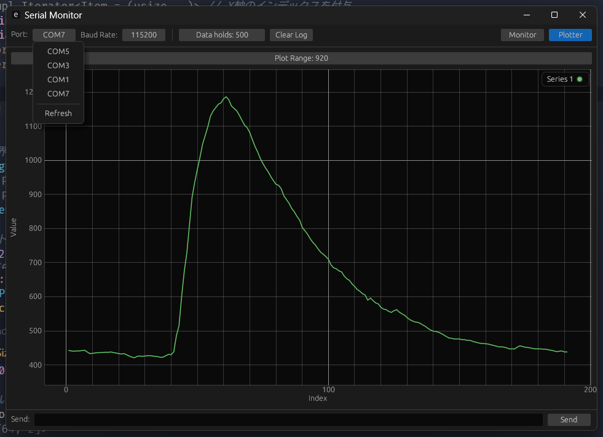

# Rust製 シリアルプロッター＆モニター

このアプリケーションは、Rustで開発された高機能なシリアル通信ツールです。シリアルポートから受信したデータをリアルタイムでモニタリングしたり、数値を抽出してグラフとしてプロットしたりすることができます。

## スクリーンショット



## 主な機能

- **シリアルモニター**: シリアルポートから受信した生データをリアルタイムでテキスト表示します。
- **リアルタイムプロッター**:
  - 受信データからカンマ(`,`)区切りの数値を自動で抽出し、グラフにプロットします。
  - 複数のデータ系列を同時に描画できます。
  - グラフのY軸は、表示されているデータの最小値・最大値に合わせて自動でスケーリングされます。
- **動的な接続設定**:
  - 利用可能なシリアルポートを自動で検出し、GUIから選択できます。
  - 一般的なボーレートのリストから接続設定を選択・変更できます。
- **データ送信**: GUIのテキストボックスから、接続先のデバイスにデータを送信できます。
- **データ保持数設定**: モニターやプロッターで表示・保持するデータポイントの最大数をGUIから設定できます。

## プロットデータの形式

プロッターは、改行(`\n`)で終わる一行の中から、カンマ(`,`)で区切られた数値を抽出します。
例えば、マイコンから以下のような形式でデータを送信すると、3つのデータ系列としてプロットされます。

```
1.23,4.56,7.89
-0.5,2.1,9.0
```

数値として解釈できない部分や、データがない箇所は無視されます。

## ビルドと実行

以下のコマンドでアプリケーションをビルドし、実行できます。

```bash
cargo run --release
```

## 使用技術

- eframe / egui_plot
- serialport
- crossbeam
- parking_lot
- chrono
- regex

---

Readme is generated by Gemini
